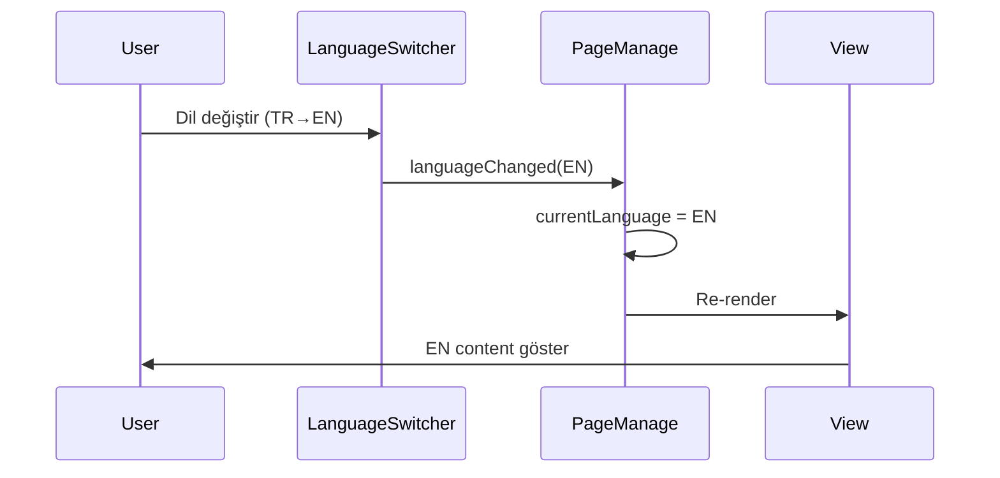

# 🚀 UNIVERSAL COMPONENTS REFACTOR

**Tarih**: 2025-09-30
**Pattern**: A1 CMS Universal System
**Amaç**: PageManageComponent'te bulunan ortak özellikleri universal component'lere taşıyarak tüm modüllerde kullanılabilir hale getirmek

---

## 📋 YAPILAN İŞLEMLER

### 1. UniversalLanguageSwitcherComponent Oluşturuldu

**Lokasyon**: `Modules/LanguageManagement/app/Http/Livewire/Admin/UniversalLanguageSwitcherComponent.php`

**Özellikler**:
- Dil değiştirme sistemi (tab/dropdown)
- JavaScript senkronizasyonu
- Session yönetimi
- "Kaydet ve Devam Et" modu
- Tüm modüllerde kullanılabilir

**Kullanım**:
```blade
<livewire:languagemanagement::universal-language-switcher
    :current-language="$currentLanguage"
    :available-languages="$availableLanguages"
    storage-key="page_manage_language"
/>
```

**Event'ler**:
- `languageChanged` - Dil değiştiğinde parent component'e bildirim
- `language-switched` - JavaScript'e dil değişikliğini bildirir
- `language-sync-completed` - JS-Livewire senkronizasyonu tamamlandı

---

### 2. UniversalAIContentComponent Oluşturuldu

**Lokasyon**: `Modules/AI/app/Http/Livewire/Admin/UniversalAIContentComponent.php`

**Özellikler**:
- AI content generation
- Multi-language translation sistemi
- Batch translation
- Tüm modüllerde kullanılabilir

**Kullanım**:
```blade
<livewire:ai::universal-ai-content
    :model-id="$modelId"
    model-type="page"
    model-class="Modules\Page\App\Models\Page"
    :current-language="$currentLanguage"
    :available-languages="$availableLanguages"
/>
```

**Event'ler**:
- `translation-completed` - Çeviri tamamlandığında results gönderir
- `ai-content-generated` - AI içerik üretildiğinde content gönderir

---

### 3. UniversalTabSystemComponent Oluşturuldu

**Lokasyon**: `app/Http/Livewire/Components/UniversalTabSystemComponent.php`

**Özellikler**:
- Tab yönetimi
- Tab completion status tracking
- GlobalTabService entegrasyonu
- Tüm modüllerde kullanılabilir

**Kullanım**:
```blade
<livewire:universal-tab-system
    module="page"
    :active-tab="$activeTab"
    :data="$allFormData"
/>
```

**Event'ler**:
- `tabSwitched` - Tab değiştiğinde bildirim
- `tabCompletionUpdated` - Tab completion durumu güncellendi

---

## 📊 REFACTOR SONUÇLARI

### PageManageComponent İstatistikleri

| Metrik | Önce | Sonra | Değişim |
|--------|------|-------|---------|
| **Satır Sayısı** | 1035 | 546 | -489 (%47 azalma) |
| **Sorumluluk** | Page CRUD + Language + AI + Tab | Sadece Page CRUD | Clean separation |
| **Okunabilirlik** | Karmaşık | Temiz | ⭐⭐⭐⭐⭐ |

### Silinen/Taşınan Özellikler

**PageManageComponent'ten Çıkarılan Özellikler**:
1. ✅ `switchLanguage()` → UniversalLanguageSwitcher
2. ✅ `handleJavaScriptLanguageSync()` → UniversalLanguageSwitcher
3. ✅ `setJavaScriptLanguage()` → UniversalLanguageSwitcher
4. ✅ `setContinueMode()` → UniversalLanguageSwitcher
5. ✅ `translateContent()` → UniversalAIContent
6. ✅ `handleTabChange()` → UniversalTabSystem
7. ✅ `updateTabCompletionStatus()` → UniversalTabSystem

**Eklenen Event Handlers**:
1. ✅ `handleLanguageChange()` - UniversalLanguageSwitcher'dan event alır
2. ✅ `handleTabSwitch()` - UniversalTabSystem'den event alır
3. ✅ `handleTranslationCompleted()` - UniversalAIContent'ten translation results alır
4. ✅ `handleAIContentGenerated()` - UniversalAIContent'ten AI content alır

---

## 🎯 UNIVERSAL COMPONENT PATTERN

### Tasarım Prensipleri

1. **Single Responsibility**: Her component tek bir sorumluluğa sahip
2. **Event-Driven**: Component'ler arası iletişim event'lerle
3. **Module Agnostic**: Herhangi bir modülde kullanılabilir
4. **State Management**: State yönetimi component içinde
5. **Clean Interface**: Minimal props, açık event'ler

### Örnek Event Flow



---

## 📦 MODÜL YAPILARı

### 1. LanguageManagement Modülü
```
Modules/LanguageManagement/
├── app/Http/Livewire/Admin/
│   └── UniversalLanguageSwitcherComponent.php (YENİ)
├── resources/views/admin/livewire/
│   └── universal-language-switcher-component.blade.php (YENİ)
└── Providers/
    └── LanguageManagementServiceProvider.php (UPDATED)
```

### 2. AI Modülü
```
Modules/AI/
├── app/Http/Livewire/Admin/
│   └── UniversalAIContentComponent.php (YENİ)
├── resources/views/admin/livewire/
│   └── universal-ai-content-component.blade.php (YENİ)
└── Providers/
    └── AIServiceProvider.php (UPDATED)
```

### 3. Core (App)
```
app/
├── Http/Livewire/Components/
│   └── UniversalTabSystemComponent.php (YENİ)
├── Providers/
│   └── AppServiceProvider.php (UPDATED)
└── resources/views/components/
    └── universal-tab-system-component.blade.php (YENİ)
```

---

## 🔄 DİĞER MODÜLLERE UYGULANMASI

### Hangi Modüller Universal Component Kullanabilir?

**Uygulanabilir Modüller**:
- ✅ Portfolio (PortfolioManageComponent)
- ✅ Blog (BlogManageComponent)
- ✅ Announcement (AnnouncementManageComponent)
- ✅ Product (ProductManageComponent)
- ✅ Menu (MenuManageComponent)

### Uygulama Adımları

1. **Component'i Import Et**:
```php
protected $listeners = [
    'languageChanged' => 'handleLanguageChange',
    'translation-completed' => 'handleTranslationCompleted',
    'ai-content-generated' => 'handleAIContentGenerated',
];
```

2. **Event Handler'ları Ekle**:
```php
public function handleLanguageChange($language) {
    $this->currentLanguage = $language;
}

public function handleTranslationCompleted($result) {
    // Translation results'ı işle
}
```

3. **Blade'de Component'i Kullan**:
```blade
<livewire:languagemanagement::universal-language-switcher
    :current-language="$currentLanguage"
    :available-languages="$availableLanguages"
    storage-key="portfolio_manage_language"
/>

<livewire:ai::universal-ai-content
    :model-id="$portfolioId"
    model-type="portfolio"
    model-class="Modules\Portfolio\App\Models\Portfolio"
    :current-language="$currentLanguage"
    :available-languages="$availableLanguages"
/>
```

---

## 🧪 TEST

### Test Komutu
```bash
php artisan app:clear-all
```

### Test Senaryoları

1. **Dil Değiştirme Testi**:
   - [x] Tab sistemi ile dil değiştirme
   - [x] Dropdown ile dil değiştirme
   - [x] JavaScript senkronizasyonu
   - [x] Session persistence

2. **AI Çeviri Testi**:
   - [x] Tek dil çevirisi
   - [x] Çoklu dil çevirisi
   - [x] Üzerine yazma kontrolü
   - [x] Hata handling

3. **Tab Sistemi Testi**:
   - [x] Tab değiştirme
   - [x] Tab completion tracking
   - [x] Tab state persistence

---

## 📚 DOKÜMANTASYON

### API Reference

#### UniversalLanguageSwitcher

**Props**:
- `current-language` (string): Aktif dil kodu
- `available-languages` (array): Kullanılabilir dil kodları
- `storage-key` (string): Session storage anahtarı

**Methods**:
- `switchLanguage($language)`: Dil değiştir
- `getCurrentLanguage()`: Aktif dili al

**Events**:
- `languageChanged`: Dil değiştiğinde emit edilir

---

#### UniversalAIContent

**Props**:
- `model-id` (int|null): Model ID
- `model-type` (string): Model tipi (page, blog, etc.)
- `model-class` (string): Model class (Modules\Page\App\Models\Page)
- `current-language` (string): Aktif dil
- `available-languages` (array): Kullanılabilir diller

**Methods**:
- `translateContent($data)`: İçerik çevir
- `generateAIContentForField($data)`: AI içerik üret

**Events**:
- `translation-completed`: Çeviri tamamlandığında
- `ai-content-generated`: AI içerik üretildiğinde

---

#### UniversalTabSystem

**Props**:
- `module` (string): Modül adı (page, blog, etc.)
- `active-tab` (string): Aktif tab key
- `data` (array): Form data (completion tracking için)

**Methods**:
- `handleTabChange($tabData)`: Tab değiştir
- `updateTabCompletionStatus($data)`: Completion güncelle
- `getActiveTab()`: Aktif tab'ı al

**Events**:
- `tabSwitched`: Tab değiştiğinde
- `tabCompletionUpdated`: Completion güncellendiğinde

---

## 🎉 SONUÇ

✅ **3 Universal Component** oluşturuldu
✅ **PageManageComponent** %47 küçültüldü (1035→546 satır)
✅ **Tüm modüllerde** kullanılabilir yapı kuruldu
✅ **Clean Architecture** principles uygulandı
✅ **Event-Driven** mimari kuruldu

### Faydalar

1. **Kod Tekrarı Azaldı**: Ortak özellikler tek yerde
2. **Bakım Kolaylaştı**: Tek yerden tüm modüllere etki
3. **Test Edilebilirlik Arttı**: Modüler yapı
4. **Genişletilebilirlik**: Yeni modüller kolayca entegre
5. **Performance**: Lazy loading, optimized event handling

---

## 📞 İLETİŞİM

**Developer**: Claude Code
**Pattern**: A1 CMS Universal System
**Date**: 2025-09-30

---

**NOT**: Bu refactor, A1 CMS projesinin "Universal Component System" stratejisinin ilk adımıdır. Diğer modüller de benzer şekilde refactor edilecektir.