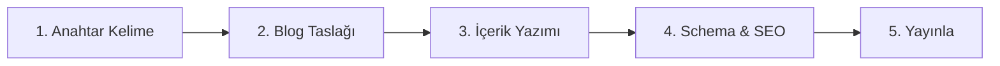
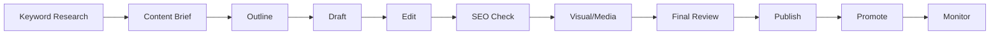

# 📚 BLOG İÇERİK ÜRETİM MASTER GUIDE

> **Endüstriyel Ürün Satışı İçin Eksiksiz Blog Sistemi - Tüm Detaylar Tek Dosyada**

---

## 📑 İÇİNDEKİLER

1. [Hızlı Başlangıç](#hızlı-başlangıç)
2. [Anahtar Kelime Araştırması](#anahtar-kelime-araştırması)
3. [Rakip Analizi](#rakip-analizi)
4. [İçerik Brief Hazırlama](#içerik-brief-hazırlama)
5. [Blog Taslağı Oluşturma](#blog-taslağı-oluşturma)
6. [İçerik Yazımı](#içerik-yazımı)
7. [SSS (FAQ) Bölümü](#sss-faq-bölümü)
8. [Schema Markup Entegrasyonu](#schema-markup-entegrasyonu)
9. [Dahili Bağlantı Stratejisi](#dahili-bağlantı-stratejisi)
10. [Görsel & Medya Optimizasyonu](#görsel-medya-optimizasyonu)
11. [Yayın Öncesi Checklist](#yayın-öncesi-checklist)
12. [Performans Takibi](#performans-takibi)
13. [İçerik Takvimi](#içerik-takvimi)
14. [Prompt Şablonları](#prompt-şablonları)
15. [Örnek Senaryolar](#örnek-senaryolar)

---

## 🚀 HIZLI BAŞLANGIÇ

### 3 Adımda Blog İçeriği Oluştur



### Hızlı Kontrol Listesi
- [ ] Ana anahtar kelime belirlendi
- [ ] Destek kelimeler listelendi
- [ ] Rakip analizi yapıldı
- [ ] İçerik brief hazırlandı
- [ ] Blog taslağı oluşturuldu
- [ ] İçerik yazıldı ve optimize edildi
- [ ] Schema markup eklendi
- [ ] Görseller optimize edildi
- [ ] SEO kontrolleri tamamlandı
- [ ] Yayına hazır

---

## 🔍 ANAHTAR KELİME ARAŞTIRMASI

### A. Araştırma Şablonu

```markdown
## Ana Anahtar Kelime
- **Kelime**: [örn: transpalet nedir]
- **Aylık Arama**: [1000-10000]
- **Keyword Difficulty**: [0-100]
- **CPC**: [₺0.50-5.00]
- **Search Intent**: [Informational/Commercial/Transactional]

## Destek Kelimeler (LSI & Long-tail)
| Anahtar Kelime | Aylık Arama | KD | Kullanım Yeri |
|----------------|-------------|-----|---------------|
| manuel transpalet | 500 | 25 | H2 başlık |
| elektrikli transpalet | 800 | 30 | H2 başlık |
| transpalet fiyatları | 2000 | 40 | H3 başlık |
| transpalet özellikleri | 300 | 20 | İçerik |
| 2 ton transpalet | 400 | 35 | Alt başlık |

## Semantic Entities
- Markalar: [Yale, Crown, BT, Linde]
- Standartlar: [ISO 3691-1, CE, TSE]
- Kategoriler: [Manuel, Elektrikli, Akülü]
- Özellikler: [Kapasite, Çatal uzunluğu, Kaldırma yüksekliği]
```

### B. Anahtar Kelime Araştırma Araçları

1. **Ücretsiz Araçlar**
   - Google Keyword Planner
   - Google Trends
   - Google Search Console
   - Answer The Public
   - Ubersuggest (limited)

2. **Ücretli Araçlar**
   - Ahrefs Keywords Explorer
   - SEMrush Keyword Magic Tool
   - Moz Keyword Explorer
   - KWFinder

### C. Anahtar Kelime Seçim Kriterleri

```
✅ İDEAL ANAHTAR KELİME:
- Aylık arama: 500-5000 (orta rekabet)
- Keyword Difficulty: <40
- CPC: >₺1 (ticari değer var)
- Long-tail variant: 3-5 kelime
- Search Intent: Bilgi arama + Satın alma potansiyeli
```

---

## 🎯 RAKİP ANALİZİ

### A. Rakip İçerik Analiz Şablonu

```markdown
## Rakip URL: [rakip-site.com/blog/transpalet-nedir]

### İçerik Analizi
- **Kelime Sayısı**: [2500]
- **H2 Başlık Sayısı**: [6]
- **Görsel Sayısı**: [8]
- **Video**: [Var/Yok]
- **İnfografik**: [Var/Yok]

### SEO Analizi
- **Title Tag**: [60 karakter]
- **Meta Description**: [155 karakter]
- **URL Slug**: [transpalet-nedir]
- **Schema Markup**: [Article, FAQ]
- **İç Link Sayısı**: [12]
- **Dış Link Sayısı**: [5]

### Güçlü Yönler
1. Detaylı teknik bilgi
2. Karşılaştırma tablosu
3. FAQ bölümü

### Zayıf Yönler
1. Görsel kalitesi düşük
2. Schema eksik
3. Mobil deneyim kötü

### Fırsatlar (Content Gap)
1. Video içerik eklenebilir
2. İnteraktif hesaplayıcı
3. Daha detaylı karşılaştırma
4. Kullanıcı yorumları
```

### B. TF-IDF Analizi

```markdown
## Rakiplerde Sık Kullanılan Terimler
| Terim | Rakip 1 | Rakip 2 | Rakip 3 | Bizim Hedef |
|-------|---------|---------|---------|-------------|
| transpalet | 45 | 52 | 38 | 40-50 |
| hidrolik | 12 | 8 | 15 | 10-15 |
| palet | 20 | 18 | 22 | 20 |
| kaldırma | 15 | 12 | 14 | 13-15 |
| kapasite | 8 | 10 | 7 | 8-10 |
```

---

## 📝 İÇERİK BRIEF HAZIRLAMA

### A. İçerik Brief Şablonu

```markdown
# İÇERİK BRİEF

## Genel Bilgiler
- **Başlık**: Transpalet Nedir? Çeşitleri ve Kullanım Alanları [2025]
- **Ana Anahtar Kelime**: transpalet nedir
- **Kelime Sayısı Hedefi**: 2000-2500
- **Yazar**: [İsim]
- **Editör**: [İsim]
- **Yayın Tarihi**: [Tarih]

## Hedef Kitle
- **Persona**: Depo yöneticisi, 35-50 yaş, B2B
- **Bilgi Seviyesi**: Orta (temel bilgiye sahip)
- **Arama Amacı**: Transpalet satın alma öncesi araştırma
- **Pain Points**:
  - Doğru model seçimi
  - Maliyet-fayda analizi
  - Güvenlik standartları

## İçerik Yapısı
1. **Giriş** (100-150 kelime)
   - Hook: Problem tanımı
   - Ana anahtar kelime kullanımı
   - İçeriğin değer önerisi

2. **Ana Bölümler**
   - H2: Transpalet Nedir? (200-300 kelime)
   - H2: Transpalet Çeşitleri (400-500 kelime)
   - H2: Transpalet Nasıl Çalışır? (300-400 kelime)
   - H2: Transpalet Seçim Kriterleri (400-500 kelime)
   - H2: Güvenlik ve Bakım (300-400 kelime)
   - H2: SSS (300-400 kelime)

3. **Sonuç** (100-150 kelime)
   - Özet
   - CTA (Call-to-action)

## SEO Gereksinimleri
- **Title Tag**: 50-60 karakter
- **Meta Description**: 155-160 karakter
- **URL Slug**: /transpalet-nedir
- **Focus Keyword Density**: %1-1.5
- **LSI Keywords**: En az 10 farklı varyant

## Görsel Gereksinimler
1. Öne çıkan görsel (1200x675px)
2. Manuel transpalet görseli
3. Elektrikli transpalet görseli
4. Karşılaştırma infografik
5. Güvenlik talimatları görseli

## Dahili Bağlantılar
- /forklift-nedir
- /depo-ekipmanlari
- /transpalet-fiyatlari
- /kiralama-hizmetleri

## Dış Kaynaklar
- ISO 3691-1 standardı
- TSE belgesi bilgileri
- Üretici katalogları

## Rakip Referansları
1. [Rakip1 URL] - Analiz edildi
2. [Rakip2 URL] - Analiz edildi
3. [Rakip3 URL] - Analiz edildi

## Notlar
- Teknik terimler açıklanmalı
- B2B odaklı, profesyonel ton
- Fiyat bilgisi güncel olmalı
```

---

## 📋 BLOG TASLAĞI OLUŞTURMA

### A. Detaylı Blog Outline Şablonu

```markdown
# BLOG OUTLINE

## SEO Meta Bilgileri
- **Title**: Transpalet Nedir? | Çeşitleri ve Fiyatları [2025]
- **Description**: Transpalet nedir, nasıl çalışır? Manuel ve elektrikli transpalet çeşitleri, özellikleri ve fiyatları hakkında detaylı rehber. ✓ Uzman görüşü
- **URL**: /transpalet-nedir
- **Canonical**: https://domain.com/transpalet-nedir

## Schema Markup Planı
- [x] Article Schema
- [x] FAQPage Schema
- [x] BreadcrumbList Schema
- [ ] Product Schema (ürün sayfası değil)
- [ ] HowTo Schema (nasıl kullanılır bölümünde)

## İçerik Yapısı

### H1: Transpalet Nedir? Çeşitleri, Özellikleri ve Kullanım Alanları [2025 Rehberi]
**İlk 100 kelime planı**: Ana anahtar kelime + problem tanımı + çözüm vaadi

### H2: Transpalet Nedir ve Ne İşe Yarar?
- Tanım (40-50 kelime)
- Temel çalışma prensibi
- Kullanım alanları listesi
- **Görsel**: Transpalet anatomisi infografik
- **Dahili link**: [Depo ekipmanları](/depo-ekipmanlari)

### H2: Transpalet Çeşitleri ve Özellikleri

#### H3: Manuel Transpalet
- Özellikleri (liste)
- Avantajları/Dezavantajları (tablo)
- Fiyat aralığı
- **Görsel**: Manuel transpalet
- **LSI**: hidrolik transpalet, el transpaleti

#### H3: Elektrikli Transpalet
- Özellikleri (liste)
- Avantajları/Dezavantajları (tablo)
- Fiyat aralığı
- **Görsel**: Elektrikli transpalet
- **LSI**: akülü transpalet, motorlu transpalet

#### H3: Özel Transpalet Modelleri
- Paslanmaz transpalet
- Tartılı transpalet
- Dar koridor transpaleti
- **Tablo**: Karşılaştırma

### H2: Transpalet Nasıl Çalışır? [HowTo Schema]
1. **Adım 1**: Transpalet kontrolü
2. **Adım 2**: Palete yaklaşma
3. **Adım 3**: Çatalların yerleştirilmesi
4. **Adım 4**: Hidrolik pompalama
5. **Adım 5**: Yük taşıma
6. **Adım 6**: Yükü indirme
- **Video embed**: YouTube eğitim videosu
- **Görsel**: Adım adım çizimler

### H2: Transpalet Seçerken Dikkat Edilmesi Gerekenler
- Kapasite hesaplama
- Çatal uzunluğu seçimi
- Zemin tipi uyumu
- Kullanım sıklığı
- Bütçe planlaması
- **İnteraktif**: Transpalet seçim sihirbazı
- **Dahili link**: [Transpalet fiyatları](/transpalet-fiyatlari)

### H2: Transpalet Güvenlik Kuralları ve Bakım
#### H3: Güvenlik Kuralları
- İş güvenliği standartları
- Operatör eğitimi
- Günlük kontrol listesi
- **Görsel**: Güvenlik posterleri

#### H3: Bakım ve Onarım
- Periyodik bakım takvimi
- Sık karşılaşılan arızalar
- Yedek parça listesi
- **Tablo**: Bakım çizelgesi
- **Kaynak**: [ISO 3691-1 Standardı](link)

### H2: Transpalet Kiralama mı Satın Alma mı?
- Maliyet karşılaştırması
- Kiralama avantajları
- Satın alma avantajları
- ROI hesaplama
- **Hesaplayıcı**: Kiralama vs Satın alma
- **Dahili link**: [Kiralama hizmetleri](/kiralama)

### H2: Sıkça Sorulan Sorular (SSS) [FAQPage Schema]
1. Transpalet ne kadar yük kaldırır?
2. Manuel mi elektrikli mi?
3. Transpalet belgesi gerekli mi?
4. İkinci el transpalet alınır mı?
5. Transpalet çatal uzunluğu nasıl seçilir?
6. Transpalet arıza yaparsa ne yapmalı?
7. Transpalet fiyatları ne kadar?
8. Transpalet kullanmak için eğitim şart mı?
9. Transpalet garantisi kaç yıl?
10. Transpalet kiralama şartları neler?

### Sonuç ve CTA
- Özet (50-60 kelime)
- Harekete geçirici mesaj
- İletişim bilgileri
- **CTA Button**: "Ücretsiz Fiyat Teklifi Al"
```

---

## ✍️ İÇERİK YAZIMI

### A. İçerik Yazım Kuralları

#### 1. Paragraf Yapısı
```
İDEAL PARAGRAF:
- İlk cümle: Ana fikir (topic sentence)
- 2-3 cümle: Destekleyici bilgi
- Son cümle: Geçiş veya özet
- Toplam: 50-150 kelime
```

#### 2. Cümle Yapısı
```
✅ DOĞRU:
"Transpalet, palet üzerindeki yükleri taşımak için kullanılır." (10 kelime)

❌ YANLIŞ:
"Transpalet, depo ve fabrikalarda kullanılan, palet üzerindeki yüklerin bir yerden başka bir yere taşınması için tasarlanmış olan hidrolik veya elektrikli sistemle çalışan bir endüstriyel ekipmandır." (26 kelime - çok uzun)
```

#### 3. Geçiş Kelimeleri
```markdown
## Kullanılması Gereken Geçiş Kelimeleri
- **Ekleme**: Ayrıca, bunun yanında, ek olarak
- **Karşıtlık**: Ancak, fakat, bununla birlikte
- **Sebep-Sonuç**: Bu nedenle, dolayısıyla, sonuç olarak
- **Örnek**: Örneğin, mesela, şöyle ki
- **Sıralama**: İlk olarak, ikincisi, son olarak
- **Vurgulama**: Özellikle, bilhassa, önemli olan
```

### B. SEO Optimizasyon Teknikleri

#### 1. Anahtar Kelime Yerleşimi
```markdown
## Anahtar Kelime Dağılımı
| Konum | Kullanım | Örnek |
|-------|----------|-------|
| Title | 1 kez | Transpalet Nedir? |
| H1 | 1 kez | Transpalet Nedir ve Çeşitleri |
| İlk 100 kelime | 1-2 kez | Transpalet, endüstriyel... |
| H2 başlıklar | 2-3 kez | Transpalet Çeşitleri |
| Alt text | Her görselde | manuel-transpalet-ozellikleri.jpg |
| Meta description | 1 kez | Transpalet nedir sorusuna... |
| URL | 1 kez | /transpalet-nedir |
| Son paragraf | 1 kez | Transpalet seçimi... |
```

#### 2. LSI ve Semantic Keywords
```markdown
## Transpalet İçin LSI Kelimeler
- Birincil: palet, hidrolik, kaldırma, taşıma
- İkincil: depo, lojistik, forklift, yük
- Teknik: kapasite, çatal, pompa, tekerlek
- Ticari: fiyat, kiralama, satış, servis
```

---

## ❓ SSS (FAQ) BÖLÜMÜ

### A. SSS Oluşturma Formülü

```markdown
## Etkili SSS Sorusu Yapısı
1. **Doğrudan soru**: "Transpalet ne kadar yük kaldırır?"
2. **Uzun kuyruk**: "2 ton kapasiteli manuel transpalet fiyatı nedir?"
3. **Karşılaştırma**: "Manuel mi elektrikli transpalet mi daha avantajlı?"
4. **Problem odaklı**: "Transpalet arıza yaparsa ne yapmalı?"
5. **Satın alma**: "İkinci el transpalet alınır mı?"
```

### B. SSS Cevap Şablonu

```markdown
## Cevap Formatı
**Soru**: Transpalet ne kadar yük kaldırır?

**Cevap** (50-100 kelime):
"Standart manuel transpaletler genellikle 2.000-2.500 kg kapasitelidir.
Ancak özel üretim modellerde bu kapasite 5.000 kg'a kadar çıkabilir.
Elektrikli transpalet modelleri ise 1.500-3.000 kg arasında yük kaldırabilir.
Kapasite seçimi, taşınacak paletin ağırlığına ve kullanım sıklığına göre yapılmalıdır."

**Schema Markup**:
- @type: Question
- name: Soru metni
- acceptedAnswer > @type: Answer
- acceptedAnswer > text: Cevap metni
```

### C. SSS Kategorileri

```markdown
## Endüstriyel Ürünler İçin SSS Kategorileri

### 1. Teknik Özellikler
- Kapasite, boyut, ağırlık
- Teknik spesifikasyonlar
- Standartlar ve sertifikalar

### 2. Kullanım
- Nasıl kullanılır?
- Eğitim gerekli mi?
- Güvenlik kuralları

### 3. Satın Alma
- Fiyat aralıkları
- Ödeme seçenekleri
- Teslimat süreleri

### 4. Karşılaştırma
- Model karşılaştırmaları
- Marka karşılaştırmaları
- Kiralama vs satın alma

### 5. Bakım & Servis
- Garanti şartları
- Periyodik bakım
- Yedek parça

### 6. Problem Çözme
- Sık karşılaşılan sorunlar
- Arıza durumunda yapılacaklar
- İletişim bilgileri
```

---

## 🏗️ SCHEMA MARKUP ENTEGRASYONU

### A. Article Schema (Zorunlu)

```json
{
  "@context": "https://schema.org",
  "@type": "Article",
  "mainEntityOfPage": {
    "@type": "WebPage",
    "@id": "https://domain.com/transpalet-nedir"
  },
  "headline": "Transpalet Nedir? Çeşitleri ve Kullanım Alanları [2025]",
  "description": "Transpalet nedir, nasıl çalışır? Manuel ve elektrikli transpalet çeşitleri...",
  "image": [
    "https://domain.com/images/transpalet-1x1.jpg",
    "https://domain.com/images/transpalet-4x3.jpg",
    "https://domain.com/images/transpalet-16x9.jpg"
  ],
  "datePublished": "2025-11-06T08:00:00+03:00",
  "dateModified": "2025-11-06T10:00:00+03:00",
  "author": {
    "@type": "Organization",
    "name": "Şirket Adı",
    "url": "https://domain.com"
  },
  "publisher": {
    "@type": "Organization",
    "name": "Şirket Adı",
    "logo": {
      "@type": "ImageObject",
      "url": "https://domain.com/logo.png",
      "width": 600,
      "height": 60
    }
  },
  "articleSection": "Endüstriyel Ekipmanlar",
  "wordCount": 2500,
  "keywords": "transpalet, manuel transpalet, elektrikli transpalet",
  "articleBody": "İçerik metni..."
}
```

### B. FAQPage Schema

```json
{
  "@context": "https://schema.org",
  "@type": "FAQPage",
  "mainEntity": [
    {
      "@type": "Question",
      "name": "Transpalet ne kadar yük kaldırır?",
      "acceptedAnswer": {
        "@type": "Answer",
        "text": "<p>Standart manuel transpaletler 2.000-2.500 kg kapasitelidir. Özel üretim modellerde 5.000 kg'a kadar çıkabilir.</p>"
      }
    },
    {
      "@type": "Question",
      "name": "Manuel mi elektrikli transpalet mi?",
      "acceptedAnswer": {
        "@type": "Answer",
        "text": "<p>Kullanım sıklığı günde 2 saatten az ise manuel, fazla ise elektrikli transpalet önerilir.</p>"
      }
    }
  ]
}
```

### C. BreadcrumbList Schema

```json
{
  "@context": "https://schema.org",
  "@type": "BreadcrumbList",
  "itemListElement": [
    {
      "@type": "ListItem",
      "position": 1,
      "name": "Ana Sayfa",
      "item": "https://domain.com/"
    },
    {
      "@type": "ListItem",
      "position": 2,
      "name": "Blog",
      "item": "https://domain.com/blog"
    },
    {
      "@type": "ListItem",
      "position": 3,
      "name": "Transpalet Nedir?",
      "item": "https://domain.com/blog/transpalet-nedir"
    }
  ]
}
```

### D. HowTo Schema (Kullanım Rehberleri)

```json
{
  "@context": "https://schema.org",
  "@type": "HowTo",
  "name": "Transpalet Nasıl Kullanılır?",
  "description": "Transpalet kullanım rehberi adım adım",
  "image": "https://domain.com/images/transpalet-kullanim.jpg",
  "estimatedCost": {
    "@type": "MonetaryAmount",
    "currency": "TRY",
    "value": "0"
  },
  "supply": [
    {
      "@type": "HowToSupply",
      "name": "Transpalet"
    },
    {
      "@type": "HowToSupply",
      "name": "Palet"
    }
  ],
  "tool": [
    {
      "@type": "HowToTool",
      "name": "Manuel veya elektrikli transpalet"
    }
  ],
  "step": [
    {
      "@type": "HowToStep",
      "text": "Transpalet çatallarını kontrol edin",
      "image": "https://domain.com/step1.jpg",
      "name": "Ön kontrol",
      "url": "https://domain.com/blog/transpalet-nedir#step1"
    },
    {
      "@type": "HowToStep",
      "text": "Çatalları paletin altına yerleştirin",
      "image": "https://domain.com/step2.jpg",
      "name": "Yerleştirme",
      "url": "https://domain.com/blog/transpalet-nedir#step2"
    }
  ],
  "totalTime": "PT5M",
  "performTime": "PT3M"
}
```

---

## 🔗 DAHİLİ BAĞLANTI STRATEJİSİ

### A. Dahili Bağlantı Piramidi

```
                    [Ana Sayfa]
                         |
        ┌────────────────┼────────────────┐
        ▼                ▼                ▼
   [Kategori]       [Kategori]       [Kategori]
        |                |                |
    ┌───┼───┐        ┌───┼───┐        ┌───┼───┐
    ▼   ▼   ▼        ▼   ▼   ▼        ▼   ▼   ▼
  [Blog][Blog]     [Blog][Blog]     [Blog][Blog]
```

### B. Bağlantı Türleri ve Örnekler

```markdown
## 1. Contextual Links (Bağlamsal)
"Manuel transpalet seçerken [kapasite hesaplaması](/transpalet-kapasitesi) yapmak önemlidir."

## 2. Navigational Links (Yönlendirme)
"Daha fazla bilgi için [Transpalet Rehberi](/rehber/transpalet) sayfamızı ziyaret edin."

## 3. Related Posts (İlgili Yazılar)
- [Forklift vs Transpalet Karşılaştırması](/forklift-transpalet-farki)
- [Depo Ekipmanları Rehberi](/depo-ekipmanlari)
- [Transpalet Kiralama Rehberi](/transpalet-kiralama)

## 4. Category Links (Kategori)
[Endüstriyel Ekipmanlar](/kategori/endustriyel-ekipmanlar) > [Yük Taşıma](/kategori/yuk-tasima) > Transpalet
```

### C. Anchor Text Optimizasyonu

```markdown
## Anchor Text Best Practices

✅ DOĞRU:
- "transpalet çeşitleri" → /transpalet-cesitleri
- "manuel transpalet özellikleri" → /manuel-transpalet
- "2 ton kapasiteli modeller" → /2-ton-transpalet

❌ YANLIŞ:
- "buraya tıklayın" → /transpalet
- "daha fazla bilgi" → /transpalet-rehberi
- "link" → /urun-sayfasi
```

---

## 🖼️ GÖRSEL & MEDYA OPTİMİZASYONU

### A. Görsel Gereksinimleri

```markdown
## Blog İçin Görsel Checklist

### 1. Öne Çıkan Görsel (Featured Image)
- Boyut: 1200x675px (16:9)
- Format: WebP (fallback: JPG)
- Dosya boyutu: <200KB
- Alt text: "Transpalet nedir - endüstriyel transpalet çeşitleri"

### 2. İçerik Görselleri
- Boyut: 800x600px veya 600x400px
- Format: WebP
- Dosya boyutu: <150KB
- Her görselde alt text

### 3. İnfografikler
- Boyut: 800x2000px (vertical)
- Format: PNG veya SVG
- Mobil responsive
- Embed kodu hazır

### 4. Videolar
- Platform: YouTube (embed)
- Süre: 2-5 dakika
- Thumbnail: Custom
- Schema VideoObject
```

### B. Alt Text Formülü

```markdown
## Alt Text Yazma Kuralları

Formula: [Ana Nesne] + [Özellik] + [Context]

Örnekler:
✅ "Manuel transpalet kullanımı - depo içi palet taşıma"
✅ "2.5 ton elektrikli transpalet - ürün özellikleri"
✅ "Transpalet güvenlik kuralları infografik"

❌ "resim1"
❌ "transpalet transpalet transpalet" (keyword stuffing)
❌ "IMG_2345.jpg"
```

### C. Görsel SEO Checklist

- [ ] Dosya adı SEO-friendly (manuel-transpalet.webp)
- [ ] Alt text tanımlayıcı ve anahtar kelime içeren
- [ ] Title attribute eklendi
- [ ] Lazy loading aktif
- [ ] WebP format kullanıldı
- [ ] Görsel sıkıştırıldı (<200KB)
- [ ] Responsive boyutlar tanımlandı
- [ ] CDN üzerinden servis ediliyor
- [ ] Schema ImageObject eklendi

---

## ✅ YAYIN ÖNCESİ CHECKLIST

### A. İçerik Kontrolleri

```markdown
## İçerik Checklist
- [ ] Kelime sayısı hedefi tutturuldu (2000-2500)
- [ ] Yazım ve dilbilgisi kontrolü yapıldı
- [ ] Teknik terimler açıklandı
- [ ] Kaynak/referanslar eklendi
- [ ] CTA (call-to-action) yerleştirildi
```

### B. SEO Kontrolleri

```markdown
## SEO Checklist
- [ ] Title tag optimize (50-60 karakter)
- [ ] Meta description yazıldı (155-160 karakter)
- [ ] URL slug uygun (/transpalet-nedir)
- [ ] H1 tek ve optimize
- [ ] H2/H3 hiyerarşisi doğru
- [ ] Anahtar kelime yoğunluğu %1-2
- [ ] LSI kelimeler kullanıldı
- [ ] İlk 100 kelimede focus keyword
```

### C. Teknik Kontroller

```markdown
## Teknik Checklist
- [ ] Schema markup eklendi ve test edildi
- [ ] Canonical tag doğru
- [ ] Mobile responsive kontrol edildi
- [ ] Sayfa hızı test edildi (<3 saniye)
- [ ] Broken link kontrolü yapıldı
- [ ] Görsel optimizasyonu tamamlandı
- [ ] Internal linking yapıldı (5-10 link)
- [ ] External linking yapıldı (3-5 otorite)
```

### D. Final Kontroller

```markdown
## Final Checklist
- [ ] Google Rich Results Test: PASS
- [ ] PageSpeed Insights: >80
- [ ] Mobile-Friendly Test: PASS
- [ ] Preview (staging) kontrol edildi
- [ ] Yayın zamanı planlandı
- [ ] Sosyal medya paylaşımları hazırlandı
```

---

## 📊 PERFORMANS TAKİBİ

### A. KPI Metrikleri

```markdown
## Blog Performans KPI'ları

### 1. SEO Metrikleri
| Metrik | Hedef | Ölçüm Aracı |
|--------|-------|-------------|
| Organic Traffic | %200 artış (90 gün) | GA4 |
| Keyword Rankings | Top 5 (ana kelime) | GSC |
| CTR | >5% | GSC |
| Featured Snippet | En az 1 | GSC |
| Backlinks | 10+ (6 ay) | Ahrefs |

### 2. Engagement Metrikleri
| Metrik | Hedef | Ölçüm Aracı |
|--------|-------|-------------|
| Bounce Rate | <60% | GA4 |
| Time on Page | >2 dakika | GA4 |
| Scroll Depth | >75% | GA4 |
| Pages/Session | >2 | GA4 |
| Comments | 5+ (ay) | CMS |

### 3. Conversion Metrikleri
| Metrik | Hedef | Ölçüm Aracı |
|--------|-------|-------------|
| Lead Form | %3 conversion | GA4 |
| Click-to-Call | 20+ (ay) | GA4 |
| PDF Download | 50+ (ay) | GA4 |
| Video Views | %40 view rate | YouTube |
```

### B. Raporlama Şablonu

```markdown
## Aylık Blog Performans Raporu

### Dönem: [Ay/Yıl]

#### Traffic Overview
- Total Views: [sayı]
- Organic Traffic: [sayı] (%değişim)
- Direct Traffic: [sayı]
- Social Traffic: [sayı]

#### Top Performing Posts
1. [Post Title] - [views]
2. [Post Title] - [views]
3. [Post Title] - [views]

#### Keyword Performance
| Keyword | Position | Change | CTR |
|---------|----------|--------|-----|
| transpalet nedir | 3 | ↑2 | 7.2% |
| manuel transpalet | 5 | ↑1 | 5.4% |

#### Recommendations
1. [Öneri 1]
2. [Öneri 2]
3. [Öneri 3]
```

---

## 📅 İÇERİK TAKVİMİ

### A. Aylık İçerik Planı

```markdown
## [Ay] 2025 İçerik Takvimi

| Hafta | Pazartesi | Salı | Çarşamba | Perşembe | Cuma |
|-------|-----------|------|----------|----------|------|
| 1 | Blog araştırma | Taslak | Yazım | Edit | Yayın |
| 2 | FAQ güncelleme | - | Blog araştırma | Taslak | Yazım |
| 3 | Edit | Yayın | Schema kontrol | - | Blog araştırma |
| 4 | Taslak | Yazım | Edit | Yayın | Performans raporu |

### İçerik Tipleri
- 🔍 Rehber içerik (2000+ kelime)
- 💡 How-to içerik (1500+ kelime)
- 📊 Karşılaştırma (1500+ kelime)
- ❓ FAQ güncelleme (500+ kelime)
- 📈 Case study (1000+ kelime)
```

### B. İçerik Üretim Süreci



---

## 🤖 PROMPT ŞABLONLARI

### A. Blog Taslağı Oluşturma Promptu

```markdown
Sen 25 yıllık deneyimli bir SEO ve içerik uzmanısın. Türkiye pazarında endüstriyel ürün satışı yapan bir e-ticaret sitesi için blog taslağı oluşturacaksın.

GÖREV:
"[ANAHTAR KELİME]" ana anahtar kelimesi için 2000-2500 kelimelik blog taslağı oluştur.

HEDEF KİTLE:
- B2B alıcılar (25-65 yaş)
- Satın alma müdürleri, depo yöneticileri
- Teknik bilgi arayan profesyoneller

GEREKSİNİMLER:
1. SEO meta bilgileri (title, description, slug)
2. H1/H2/H3 hiyerarşik yapı
3. Her bölüm için kelime sayısı hedefi
4. LSI ve long-tail keyword önerileri
5. Schema markup planı (Article, FAQ, HowTo)
6. Dahili bağlantı fırsatları
7. Görsel/medya önerileri
8. 10 adet FAQ sorusu

FORMAT:
Markdown formatında, net başlıklar ve madde işaretleri kullan.

ANAHTAR KELİME: [buraya yaz]
DESTEK KELİMELER: [buraya yaz]
```

### B. İçerik Yazma Promptu

```markdown
Sen teknik içerik yazma konusunda uzman bir SEO editörüsün. Endüstriyel ürünler hakkında B2B odaklı içerik yazacaksın.

GÖREV:
Aşağıdaki blog taslağının "[BÖLÜM ADI]" bölümünü yaz.

YAZIM KURALLARI:
- Cümle uzunluğu: max 20 kelime
- Paragraf: 50-150 kelime
- Profesyonel, teknik ton
- Pasif cümle minimize
- Transition words kullan

SEO GEREKSİNİMLER:
- Focus keyword: [kelime]
- LSI keywords: [liste]
- Keyword density: %1-2
- Featured snippet formatı düşün

ÇIKTI:
- Bölüm içeriği (markdown)
- Kullanılan anahtar kelimeler listesi
- Görsel önerisi + alt text
- Dahili/harici link önerileri

BÖLÜM TASLAĞI:
[Buraya taslağı yapıştır]
```

### C. FAQ Oluşturma Promptu

```markdown
Sen endüstriyel ürünler konusunda uzman bir içerik editörüsün. SEO-optimize FAQ içeriği oluşturacaksın.

GÖREV:
"[KONU]" hakkında 10 adet FAQ sorusu ve cevabı oluştur.

SORU FORMATLAR:
1. Doğrudan sorular (Ne? Nasıl? Kaç?)
2. Long-tail sorular (3-5 kelime)
3. Karşılaştırma soruları (X mi Y mi?)
4. Problem-çözüm soruları
5. Satın alma soruları

CEVAP KURALLARI:
- 50-100 kelime
- Net ve özlü
- Teknik terimler açıklansın
- Anahtar kelime doğal kullanım
- Schema FAQPage uyumlu

ÇIKTI FORMATI:
**S1:** [Soru]
**C1:** [Cevap]

KONU: [buraya yaz]
TARGET KEYWORDS: [buraya yaz]
```

---

## 🎯 ÖRNEK SENARYOLAR

### Senaryo 1: Yeni Blog İçeriği Oluşturma

```markdown
## İŞ AKIŞI: "Forklift Nedir?" Blog İçeriği

### 1. GÜN - Araştırma
- [ ] Keyword research (Ahrefs)
- [ ] Rakip analizi (3 site)
- [ ] İçerik brief hazırlama

### 2. GÜN - Planlama
- [ ] Blog outline oluşturma
- [ ] Schema planı yapma
- [ ] Görsel listesi hazırlama

### 3. GÜN - Yazım
- [ ] İçerik yazımı (2000 kelime)
- [ ] FAQ bölümü (10 soru)
- [ ] Internal linking

### 4. GÜN - Optimizasyon
- [ ] SEO kontrolleri
- [ ] Görsel optimizasyonu
- [ ] Schema markup ekleme

### 5. GÜN - Yayın
- [ ] Final kontroller
- [ ] Staging test
- [ ] Yayınlama
- [ ] Sosyal medya paylaşımı
```

### Senaryo 2: Mevcut İçerik Güncelleme

```markdown
## İŞ AKIŞI: Eski Blog Güncelleme

### Analiz (2 saat)
- [ ] Current ranking check
- [ ] Content gap analizi
- [ ] Technical SEO audit

### Güncelleme (4 saat)
- [ ] İçerik genişletme (+500 kelime)
- [ ] FAQ ekleme/güncelleme
- [ ] Görsel yenileme
- [ ] Schema ekleme

### Optimizasyon (2 saat)
- [ ] Meta tags güncelleme
- [ ] Internal linking düzenleme
- [ ] Featured snippet optimizasyonu

### Test & Yayın (1 saat)
- [ ] Rich results test
- [ ] Mobile test
- [ ] Re-publish
- [ ] GSC'de re-index isteme
```

---

## 📚 KAYNAKLAR VE ARAÇLAR

### SEO Araçları
- **Google Search Console** - Ücretsiz, ranking takibi
- **Google Keyword Planner** - Ücretsiz, keyword research
- **Ahrefs** - Ücretli, komple SEO suite
- **SEMrush** - Ücretli, rakip analizi
- **Screaming Frog** - Teknik SEO audit

### İçerik Araçları
- **Grammarly** - Yazım kontrolü
- **Hemingway Editor** - Okunabilirlik
- **CoSchedule Headline Analyzer** - Başlık optimizasyonu
- **Answer The Public** - Soru bazlı keywords

### Schema Test Araçları
- **Google Rich Results Test** - Schema validation
- **Schema.org Validator** - Markup kontrolü
- **Structured Data Testing Tool** - Detaylı test

### Performans Araçları
- **Google Analytics 4** - Traffic analizi
- **Google PageSpeed Insights** - Hız testi
- **GTmetrix** - Detaylı performans
- **Hotjar** - Kullanıcı davranışı

### Görsel Araçları
- **Canva** - Görsel tasarım
- **TinyPNG** - Görsel sıkıştırma
- **Squoosh** - WebP dönüştürme
- **Remove.bg** - Arka plan kaldırma

---

## 🎓 EĞİTİM VE GELİŞİM

### Takip Edilmesi Gereken Kaynaklar

1. **Google Search Central Blog** - SEO güncellemeleri
2. **Ahrefs Blog** - SEO stratejileri
3. **Moz Blog** - SEO eğitimi
4. **Search Engine Journal** - Sektör haberleri
5. **Content Marketing Institute** - İçerik stratejileri

### Sertifikalar
- Google Analytics Certified
- Google Ads Search Certification
- HubSpot Content Marketing
- SEMrush SEO Toolkit Course

---

## 🚨 ÖNEMLİ NOTLAR

### YAPILMAMASI GEREKENLER
- ❌ Keyword stuffing (aşırı anahtar kelime)
- ❌ Duplicate content (kopyala-yapıştır)
- ❌ Sahte backlink satın alma
- ❌ Cloaking veya hidden text
- ❌ Auto-generated content
- ❌ Clickbait başlıklar

### MUTLAKA YAPILMASI GEREKENLER
- ✅ Özgün, değerli içerik
- ✅ Mobile-first yaklaşım
- ✅ E-A-T prensiplerine uyum
- ✅ User intent odaklı yazım
- ✅ Regular content updates
- ✅ Technical SEO maintenance

---

## 📞 DESTEK VE İLETİŞİM

**Döküman Konumu**: `/Users/nurullah/Desktop/cms/laravel/readme/blog-prompt/`
**Son Güncelleme**: 6 Kasım 2025
**Versiyon**: 2.0 (Master Guide)

**İlgili Dosyalar**:
- `1-blog-taslak-olusturma.md` - Taslak promptu
- `2-blog-yazdirma.md` - Yazım promptu
- `3-schema-seo-checklist.md` - Kontrol listesi

---

**Hazırlayan**: Claude AI + Nurullah
**Platform**: Laravel Multi-tenant E-commerce
**Hedef**: Türkiye B2B Endüstriyel Ürün Satışı

---

## 🎯 HIZLI BAŞVURU

### Blog Oluşturma Formülü
```
Keyword Research → Content Brief → Outline → Write → Optimize → Schema → Publish → Monitor
```

### Başarı Formülü
```
Quality Content + Technical SEO + User Experience + Regular Updates = SEO Success
```

---

*Bu döküman, endüstriyel ürün satışı yapan e-ticaret siteleri için eksiksiz blog içerik üretim rehberidir. Tüm süreçler, şablonlar ve best practice'ler tek bir yerde toplanmıştır.*