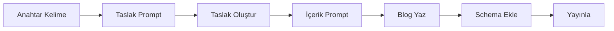

# 📝 Blog Prompt Sistemi

> **Endüstriyel ürün satışı için 2 aşamalı blog yazdırma sistemi**

---

## 🚀 TEK DOSYA YETERLİ!

```
📌 BLOG-YAZDIRMA-AKISI.md    # SADECE BUNU KULLAN
```

### Nasıl Çalışır?

**2 Basit Aşama:**
1. **TASLAK OLUŞTUR** → Yapı ve plan
2. **GERÇEK İÇERİK YAZ** → Taslağı doldur

**Süre:** ~1 saat
**Sonuç:** 2000-2500 kelimelik SEO-optimize blog

---

## 🎯 Hızlı Başlangıç

1. `BLOG-YAZDIRMA-AKISI.md` dosyasını aç
2. Taslak prompt'unu kopyala → Taslak oluştur
3. İçerik prompt'unu kopyala → Blog yaz
4. Schema ekle → Yayınla!

---

## 💡 Özellikler

✅ **Hazır Promptlar** - Kopyala/Yapıştır
✅ **2 Aşamalı Sistem** - Önce taslak, sonra içerik
✅ **SEO Optimize** - Title, meta, schema dahil
✅ **SSS Stratejisi** - 10 soru-cevap
✅ **B2B Odaklı** - Endüstriyel ürün satışı için

---

## 📊 Çıktı

Her blog için alacağınız çıktı:
- 2000-2500 kelime içerik
- SEO meta bilgileri (title, description, slug)
- H1/H2/H3 başlık yapısı
- 10 adet SSS (FAQ)
- Schema.org markup (Article + FAQPage)
- 5+ dahili link önerisi
- 3+ otorite kaynak
- Görsel önerileri + alt text

---

## 🎯 Hedef Kitle

- **Sektör:** Endüstriyel ürün satışı
- **Pazar:** Türkiye B2B
- **Okuyucu:** Satın alma müdürleri, depo yöneticileri, teknik ekipler
- **Yaş:** 25-65

---

## 📁 Dosya Yapısı

```
readme/blog-prompt/
├── BLOG-YAZDIRMA-AKISI.md    # Ana dosya (kullan bunu)
└── README.md                  # Bu dosya (açıklama)
```

---

## ⚡ Örnek Akış



---

## 📞 Destek

**Dosya Konumu:** `/Users/nurullah/Desktop/cms/laravel/readme/blog-prompt/`
**Son Güncelleme:** 6 Kasım 2025
**Platform:** Laravel Multi-tenant E-commerce
**Hedef:** Türkiye B2B Endüstriyel Ürün Satışı

---

**✨ İpucu:** `BLOG-YAZDIRMA-AKISI.md` dosyasını bookmark yapın. Her blog için bu sistemi kullanın.

---

*Hazırlayan: Claude AI + Nurullah*