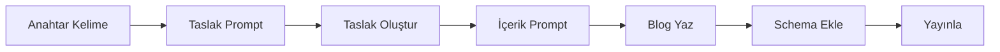

# 📝 Blog Prompt Sistemi - Endüstriyel Ürün Satışı

> **Türkiye pazarında endüstriyel ürün satışı için SEO-optimize blog içerik üretim sistemi**

---

## 🎯 Sistem Yapısı & Hangi Dosyayı Kullanmalıyım?

### 📊 Dosyaların Kullanım Amaçları

| Dosya | Kullanım Amacı | Ne Zaman Kullan? | Öncelik |
|-------|----------------|------------------|---------|
| **🤖 CHATGPT-AGENT-SYSTEM.md** | ChatGPT agent sistemi | Otomatik blog üretimi | ⭐⭐⭐⭐⭐ |
| **🚀 AGENT-WORKFLOW-GUIDE.md** | Adım adım kullanım kılavuzu | Agent workflow öğrenme | ⭐⭐⭐⭐⭐ |
| **💾 SQL-EXAMPLES.sql** | Hazır SQL örnekleri | Veritabanı işlemleri | ⭐⭐⭐⭐⭐ |
| **🎯 SEO-EKSIKLER-VE-COZUMLER.md** | SEO analiz raporu | Eksikleri tespit et | ⭐⭐⭐⭐⭐ |
| **✨ 4-gelismis-seo-eklentileri.md** | Video, Review, Social SEO | Gelişmiş optimizasyon | ⭐⭐⭐⭐⭐ |
| **BLOG-YAZDIRMA-AKISI.md** | Hızlı blog yazdırma (2 aşama) | Manuel blog yazdırma | ⭐⭐⭐⭐ |
| **1-blog-taslak-olusturma.md** | Detaylı taslak promptu | Özel taslak ihtiyacı | ⭐⭐⭐ |
| **2-blog-yazdirma.md** | Detaylı içerik yazma promptu | Özel yazım ihtiyacı | ⭐⭐⭐ |
| **3-schema-seo-checklist.md** | Final kontrol listesi | Yayın öncesi | ⭐⭐⭐⭐ |
| **MASTER-GUIDE.md** | Komple referans dökümanı | Detaylı öğrenme | ⭐⭐⭐ |

---

## 🚀 HIZLI BAŞLANGIÇ

### Blog Yazdırma İçin 4 Seçenek:

#### 🤖 **AGENT SİSTEMİ** (EN HIZLI - Önerilen)
```
📌 CHATGPT-AGENT-SYSTEM.md kullan
   ↓
   ChatGPT → SQL → Veritabanı
   ↓
   10 dakikada hazır!
```

#### 1️⃣ **MANUEL HIZLI YOL**
```
📌 BLOG-YAZDIRMA-AKISI.md kullan
   ↓
   2 aşama: Taslak → İçerik
   ↓
   1 saatte hazır
```

#### 2️⃣ **DETAYLI YOL**
```
1-blog-taslak-olusturma.md → Taslak oluştur
   ↓
2-blog-yazdirma.md → İçerik yaz
   ↓
3-schema-seo-checklist.md → Kontrol et
```

#### 3️⃣ **ÖĞRENME YOLU**
```
MASTER-GUIDE.md → Tüm sistemi öğren
```

---

## 📁 Dosya Yapısı

```
readme/blog-prompt/
├── 🤖 CHATGPT-AGENT-SYSTEM.md         # ChatGPT agent sistemi
├── 🚀 AGENT-WORKFLOW-GUIDE.md         # Agent kullanım kılavuzu
├── 💾 SQL-EXAMPLES.sql                 # Hazır SQL örnekleri
├── 🎯 SEO-EKSIKLER-VE-COZUMLER.md     # SEO analiz raporu (YENİ!)
├── ✨ 4-gelismis-seo-eklentileri.md   # Gelişmiş SEO (YENİ!)
├── 📌 BLOG-YAZDIRMA-AKISI.md          # Hızlı blog (2 aşama)
├── 📝 1-blog-taslak-olusturma.md      # Taslak promptu
├── ✍️ 2-blog-yazdirma.md              # İçerik yazma promptu
├── ✅ 3-schema-seo-checklist.md       # Kontrol listesi
├── 📚 MASTER-GUIDE.md                 # Referans dökümanı
└── 📋 README.md                       # Bu dosya (genel bakış)
```

---

## ⚡ Örnek Akış



---

## 📞 Destek

**Dosya Konumu:** `/Users/nurullah/Desktop/cms/laravel/readme/blog-prompt/`
**Son Güncelleme:** 6 Kasım 2025
**Platform:** Laravel Multi-tenant E-commerce
**Hedef:** Türkiye B2B Endüstriyel Ürün Satışı

---

**✨ İpucu:** `BLOG-YAZDIRMA-AKISI.md` dosyasını bookmark yapın. Her blog için bu sistemi kullanın.

---

*Hazırlayan: Claude AI + Nurullah*