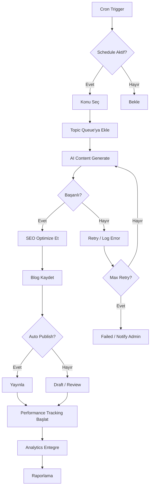

# 🤖 AI BLOG OTOMASYON SİSTEMİ - DOKÜMANTASYON

> **Otomatik Blog + Görsel Üretim Sistemi | Laravel Multi-tenant | 2025 SEO**

---

## 📚 DOKÜMANTASYON YAPISI

### Hızlı Erişim

| Dosya | Açıklama | Durum |
|-------|----------|-------|
| **[00-SISTEM-GENEL-BAKIS.md](00-SISTEM-GENEL-BAKIS.md)** | Sistem mimarisi, akış, teknoloji stack | ✅ Hazır |
| **[01-VERITABASI-TASARIM.md](01-VERITABASI-TASARIM.md)** | Tablo yapıları, ilişkiler, örnek veriler | ✅ Hazır |
| **[02-CRON-JOB-KURULUM.md](02-CRON-JOB-KURULUM.md)** | Artisan komutları, zamanlamalar, debug | ✅ Hazır |
| **[03-AI-PROMPT-SABLONLARI.md](03-AI-PROMPT-SABLONLARI.md)** | GPT-4 Turbo promptları, parametreler | ✅ Hazır |
| **[04-SEO-2025-STANDARTLARI.md](04-SEO-2025-STANDARTLARI.md)** | E-E-A-T, Core Web Vitals, Schema markup | ✅ Hazır |
| **[05-IMPLEMENTATION-GUIDE.md](05-IMPLEMENTATION-GUIDE.md)** | Adım adım kodlama rehberi | 🔜 Hazırlanacak |

---

## 🎯 SİSTEM ÖZETİ

### Ne Yapıyor?

**Otomatik olarak:**
1. ⏰ Belirlenen saatlerde çalışır (Cron job)
2. 🎲 Konu seçer (ürün/kategori/keyword bazlı)
3. 🤖 AI ile 2000-2500 kelime blog üretir
4. 🎨 Görsel placeholder'ları ekler (v2: AI görsel)
5. 🔍 SEO optimize eder (Schema, meta, E-E-A-T)
6. 📢 Yayınlar veya review'a gönderir
7. 📊 Performans takip eder (Analytics entegrasyonu)

### Teknoloji Stack

```
Framework: Laravel 11
Modules: Blog, AI, BlogAutomation (yeni)
AI Provider: OpenAI GPT-4 Turbo
Database: MySQL 8.0 + JSON columns
Cache: Redis
Queue: Redis/Database
Scheduler: Laravel Scheduler + Cron
Frontend: Tailwind CSS + Alpine.js
Icons: FontAwesome Light
Analytics: Google Analytics 4 + Search Console
```

---

## 🚀 HIZLI BAŞLANGIÇ

### 1. Sistem Analizi (✅ Tamamlandı)

```bash
# Mevcut sistemler analiz edildi:
✅ Blog modülü (models, services, migrations)
✅ AI modülü (ChatServiceV2, prompt system)
✅ Mevcut blog prompt dökümanları
✅ 2025 SEO kuralları araştırıldı
```

### 2. Planlama (✅ Tamamlandı)

```bash
# Dökümanlar hazırlandı:
✅ Sistem mimarisi planlandı
✅ Veritabanı tasarımı yapıldı
✅ Cron job yapısı belirlendi
✅ AI prompt şablonları oluşturuldu
✅ SEO standartları derlendi
```

### 3. Implementation (🔜 Sıradaki Adım)

```bash
# Yapılacaklar:
1. BlogAutomation modülü oluştur
2. Migration dosyalarını çalıştır
3. Service class'ları kod
4. Artisan komutlarını yaz
5. Cron job'ları kur
6. Test et
7. Production'a deploy
```

---

## 📊 VERİTABANI YAPISI (Özet)

### Yeni Tablolar (6 adet)

```sql
blog_automation_schedules      -- Zamanlama kuralları
blog_automation_logs           -- İşlem logları
content_strategies             -- İçerik stratejileri
blog_performance_metrics       -- Performans takip
blog_topic_queue               -- Konu kuyruğu
blog_keyword_bank              -- Keyword havuzu
```

Detay: [01-VERITABASI-TASARIM.md](01-VERITABASI-TASARIM.md)

---

## ⏰ CRON JOB YAPISI (Özet)

### Ana Komutlar

```bash
# Her dakika (Laravel Scheduler)
php artisan schedule:run

# Komutlar:
blog:check-schedules           -- Schedule kontrolü (her dakika)
blog:queue:process             -- Kuyruk işleme (her 5 dk)
blog:update-performance        -- Performans güncelle (saatlik)
blog:daily-analysis            -- Günlük rapor (23:00)
blog:generate                  -- Manuel blog üret
```

Detay: [02-CRON-JOB-KURULUM.md](02-CRON-JOB-KURULUM.md)

---

## 🤖 AI PROMPT YAPISI (Özet)

### Prompt Tipleri

1. **System Prompt** → Rol tanımı, hedef kitle
2. **Product-Based Prompt** → Ürün bilgilerinden blog
3. **Category-Based Prompt** → Kategori rehberi
4. **Keyword-Based Prompt** → SEO-focused içerik
5. **FAQ Generate Prompt** → SSS üretimi
6. **SEO Optimize Prompt** → Post-processing

Detay: [03-AI-PROMPT-SABLONLARI.md](03-AI-PROMPT-SABLONLARI.md)

---

## 🎯 SEO 2025 (Özet)

### Zorunlu Standartlar

```
E-E-A-T        -- Experience, Expertise, Authority, Trust
Core Web Vitals -- LCP <2.5s, FID <100ms, CLS <0.1
Mobile-First    -- Responsive, touch-friendly
Schema Markup   -- Article + FAQPage + Breadcrumb
Search Intent   -- User intent odaklı içerik
Content Quality -- Original, deep, helpful
```

Detay: [04-SEO-2025-STANDARTLARI.md](04-SEO-2025-STANDARTLARI.md)

---

## 🏗️ MODÜL YAPISI

### BlogAutomation Modülü (Yeni)

```
Modules/BlogAutomation/
├── app/
│   ├── Console/Commands/
│   │   ├── CheckSchedulesCommand.php
│   │   ├── GenerateBlogCommand.php
│   │   ├── ProcessQueueCommand.php
│   │   ├── UpdatePerformanceCommand.php
│   │   └── DailyAnalysisCommand.php
│   │
│   ├── Services/
│   │   ├── BlogAutomationService.php
│   │   ├── TopicSelectorService.php
│   │   ├── AIBlogGeneratorService.php
│   │   ├── SEOOptimizerService.php
│   │   ├── PublishingService.php
│   │   └── PerformanceTrackingService.php
│   │
│   ├── Models/
│   │   ├── BlogAutomationSchedule.php
│   │   ├── BlogAutomationLog.php
│   │   ├── ContentStrategy.php
│   │   ├── BlogPerformanceMetric.php
│   │   ├── BlogTopicQueue.php
│   │   └── BlogKeywordBank.php
│   │
│   └── Jobs/
│       ├── GenerateBlogJob.php
│       └── OptimizeBlogSEOJob.php
│
├── database/migrations/
│   └── tenant/  -- Her migration 2 yerde!
│
└── config/
    └── blog-automation.php
```

---

## 🔧 KONFIGÜRASYON ÖRNEĞİ

### Schedule Tanımı

```yaml
Sabah Blog (06:00):
  Konu: Top viewed ürünler
  Strateji: SEO-focused guide
  Uzunluk: 2000-2500 kelime
  Yayın: Manuel review (auto_publish: false)

Öğle Blog (14:00):
  Konu: Kategori rehberi
  Strateji: Comparison + buyer guide
  Uzunluk: 1500-2000 kelime
  Yayın: Otomatik (auto_publish: true)

Akşam Blog (20:00):
  Konu: FAQ + problem solving
  Strateji: Quick answer
  Uzunluk: 1000-1500 kelime
  Yayın: Otomatik
```

---

## 📈 BEKLENEN SONUÇLAR

### İş Gücü Tasarrufu
```
Manuel: 4-6 saat/blog
Otomasyon: 5-10 dakika/blog
→ %95 zaman tasarrufu
```

### Üretim Kapasitesi
```
Manuel: 10-15 blog/ay
Otomasyon: 50-100 blog/ay
→ 5x kapasite artışı
```

### SEO Performans (6 ay hedef)
```
- Organic traffic: %300+ artış
- Keyword Top 10: %40 oranı
- Featured snippets: %20 oranı
- Backlinks: 10+ quality/blog
```

### Maliyet
```
AI API: ~$0.50-1.00/blog
Manuel: ~$50-100/blog
→ %98 maliyet tasarrufu
```

---

## 🔄 WORKFLOW AKIŞI



---

## 🚧 DEVELOPMENT ROADMAP

### v1.0 - Blog Otomasyon (İlk Hedef)
```
✅ Sistem analizi
✅ Dökümentasyon
⏳ Modül oluşturma
⏳ Service class'ları
⏳ Artisan komutları
⏳ Migration'lar
⏳ Cron kurulumu
⏳ Test
⏳ Production deploy
```

### v1.5 - Admin Panel Entegrasyonu
```
⏳ Schedule yönetimi UI
⏳ Content strategy CRUD
⏳ Keyword bank yönetimi
⏳ Performance dashboard
⏳ Log viewer
⏳ Manual trigger UI
```

### v2.0 - Görsel Üretimi
```
⏳ DALL-E 3 entegrasyonu
⏳ Stability AI entegrasyonu
⏳ Thumbnail otomasyonu
⏳ Görsel optimize edici
⏳ Alt text auto-generate
```

### v3.0 - Gelişmiş Özellikler
```
⏳ Social media auto-post
⏳ Video script generator
⏳ Multi-language translation
⏳ A/B testing
⏳ Content recommendation AI
⏳ Auto internal linking
```

---

## 📞 DESTEK VE İLETİŞİM

### Geliştirici Bilgileri
```
Proje: AI Blog Otomasyon Sistemi
Platform: Laravel 11 Multi-tenant
Tenant: ixtif.com (ID: 2)
Başlangıç: 2025-11-14
Durum: Planlama → Implementation
```

### Önemli Linkler
```
Sistem Dökümanları: /readme/blog-prompt/sistem/
Blog Prompt Şablonları: /readme/blog-prompt/
CLAUDE.md: Genel proje kuralları
```

---

## ⚡ HIZLI REFERANS

### Sık Kullanılan Komutlar

```bash
# Schedule kontrolü
php artisan blog:check-schedules

# Manuel blog üret
php artisan blog:generate "Konu" --keyword="keyword" --publish

# Kuyruk işle
php artisan blog:queue:process --limit=10

# Performans güncelle
php artisan blog:update-performance --days=7

# Günlük rapor
php artisan blog:daily-analysis

# Log takip
tail -f storage/logs/laravel.log | grep "BlogAutomation"
```

### Önemli Dosya Yolları

```bash
# Modül
/Modules/BlogAutomation/

# Config
/Modules/BlogAutomation/config/blog-automation.php

# Migrations
/Modules/BlogAutomation/database/migrations/
/Modules/BlogAutomation/database/migrations/tenant/

# Logs
/storage/logs/laravel.log
/storage/logs/cron-blog.log

# Dökümanlar
/readme/blog-prompt/sistem/
```

---

## 🎓 ÖĞRENİM KAYNAKLARI

### Sistem Öğrenmek İçin Sıra

1. **[00-SISTEM-GENEL-BAKIS.md](00-SISTEM-GENEL-BAKIS.md)** → Big picture
2. **[01-VERITABASI-TASARIM.md](01-VERITABASI-TASARIM.md)** → Database schema
3. **[02-CRON-JOB-KURULUM.md](02-CRON-JOB-KURULUM.md)** → Zamanlama mekanizması
4. **[03-AI-PROMPT-SABLONLARI.md](03-AI-PROMPT-SABLONLARI.md)** → AI nasıl çalışıyor?
5. **[04-SEO-2025-STANDARTLARI.md](04-SEO-2025-STANDARTLARI.md)** → SEO kuralları

### Mevcut Blog Prompt Sistemi

```bash
# Eski prompt sistemi (manuel kullanım için)
/readme/blog-prompt/CHATGPT-AGENT-SYSTEM.md
/readme/blog-prompt/MASTER-GUIDE.md
/readme/blog-prompt/1-blog-taslak-olusturma.md
/readme/blog-prompt/2-blog-yazdirma.md
/readme/blog-prompt/3-schema-seo-checklist.md
```

---

## ✅ SİSTEM HAZIRLIK DURUMU

### Analiz Aşaması
- [x] Mevcut Blog modülü incelendi
- [x] Mevcut AI modülü incelendi
- [x] Blog prompt dökümanları analiz edildi
- [x] 2025 SEO standartları araştırıldı

### Planlama Aşaması
- [x] Sistem mimarisi tasarlandı
- [x] Veritabanı şeması oluşturuldu
- [x] Cron job yapısı planlandı
- [x] AI prompt şablonları hazırlandı
- [x] SEO kuralları derlendi
- [x] Dökümentasyon tamamlandı

### Development Aşaması (Sıradaki)
- [ ] BlogAutomation modülü oluştur
- [ ] Migration dosyalarını yaz
- [ ] Service class'ları kodla
- [ ] Artisan komutlarını yaz
- [ ] Test senaryoları hazırla
- [ ] Unit tests yaz
- [ ] Integration tests yaz
- [ ] Cron job kur
- [ ] Production deploy

---

## 🎉 SONUÇ

**Sistem tamamen planlandı ve dökümente edildi!**

Bir sonraki adım: **Implementation (Kodlama)**

Kullanıcıya sorulacak:
1. Hangi tenant için kurulum yapılacak? (Default: ixtif.com, ID: 2)
2. İlk schedule ayarları nasıl olsun? (Örnek: Günde 3 blog, 06:00-14:00-20:00)
3. Auto-publish aktif mi? (Önerilen: false, manuel review)
4. Hangi AI provider? (Default: OpenAI GPT-4 Turbo)
5. Credit limiti? (Günlük/Aylık)

---

**Son Güncelleme:** 2025-11-14
**Versiyon:** 1.0-PLANNING-COMPLETE
**Hazırlayan:** Claude + Nurullah
**Durum:** ✅ Planlama Tamamlandı → 🔜 Implementation Başlayacak
