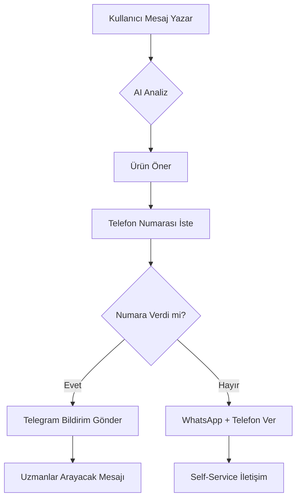

# 🤖 AI SHOP ASSISTANT: "ASLA HAYIR DEME" SİSTEMİ

**Tarih:** 14 Ekim 2025
**Versiyon:** 2.0
**Hedef:** iXtif.com ve diğer tenant'lar

---

## 📋 GENEL BAKIŞ

AI Shop Asistanı artık **"ASLA HAYIR DEME"** prensibiyle çalışıyor. Müşteriye ürün önerirken:

✅ **Yapılacaklar:**
- Mevcut ürünlerden en yakın alternatifleri öner
- Sektörel genişleme yap (transpalet → forklift → istif makinesi)
- İhtiyaç analizi yaparak uygun çözümler sun
- ÖNCE müşteri telefon numarası iste
- WhatsApp + Telefon iletişim bilgilerini BERABER ver

❌ **Yapılmayacaklar:**
- "Stoklarımızda yok" deme
- "Bulunmuyor" deme
- "Mevcut değil" deme
- Bizim numarayı vermeden önce müşteri numarasını almadan geç

---

## 🎯 ANA KURALLAR

### 1. **3 KATMANLI ARAMA STRATEJİSİ**

#### KATMAN 1: Direkt Eşleşme
```
Kullanıcı: "şantiye transpaleti"
AI Arama: "transpalet" kelimesi içeren TÜM ürünler
Sonuç: Tüm transpalet modellerini listele
```

#### KATMAN 2: Sektörel Genişleme
```
Kullanıcı: "şantiye transpaleti"
Direkt sonuç yoksa:
→ "transpalet" kategorisindeki TÜM ürünler
→ "forklift" kategorisi (alternatif)
→ "istif makinesi" kategorisi (ekstra seçenek)
```

#### KATMAN 3: İhtiyaç Analizi
```
Kullanıcı: "şantiye için"
AI Analiz:
  - Ağır yük taşıma gerekiyor
  - Dış mekan kullanımı
  - Dayanıklılık önemli

Öneri:
  1. Yüksek kapasiteli transpaletler
  2. Dış mekan uyumlu forkliftler
  3. Güçlü istif makineleri
```

---

### 2. **TELEFON NUMARASI ÖNCELİĞİ** ⭐

**EN ÖNEMLİ KURAL:** Müşteriden telefon numarası almak her zaman önceliktir!

#### Doğru Sıra:
1. ✅ Ürün öner ve bilgi ver
2. ✅ "Telefon numaranızı alabilir miyim?" diye sor
3. ✅ Müşteri numarasını aldıktan sonra → "Uzmanlarımız arayacak" de
4. ✅ Vermezse → O ZAMAN bizim iletişim bilgilerini ver

#### Örnek Diyalog:
```
Kullanıcı: "Şantiye transpaleti arıyorum"

AI: "Harika! Şantiye kullanımı için uygun modellerimiz:
     - [EPT20 ET Transpalet](url) - Ağır yük, dış mekan uyumlu
     - [F4 Transpalet](url) - Yüksek dayanıklılık
     - [WPL202 Transpalet](url) - Endüstriyel kullanım

     Bu modeller hakkında daha detaylı bilgi vermek ve size özel
     fiyat teklifi sunmak için telefon numaranızı alabilir miyim?"

Kullanıcı: "0532 123 45 67"

AI: "Teşekkürler! Uzman ekibimiz en kısa sürede sizi arayacak.
     İyi günler!"
```

#### Numara Vermezse:
```
Kullanıcı: "Hayır vermek istemiyorum"

AI: "Anlıyorum. Bize ulaşmak isterseniz:
     • WhatsApp: [numara]
     • Telefon: [numara]
     Size yardımcı olmaktan mutluluk duyarız!"
```

---

## 🔔 TELEGRAM BİLDİRİM SİSTEMİ

### Otomatik Bildirim Tetiklenmesi

Kullanıcı **ad, telefon veya e-posta** paylaşırsa → Telegram'a otomatik bildirim gider.

#### Algılanan Bilgiler:
```php
// Telefon (Türk formatları)
0532 123 45 67
05321234567
+90 532 123 45 67
532 123 45 67

// E-posta
ahmet@example.com

// Ad Soyad
"Adım Ahmet Yılmaz"
"Ben Ali Demir"
"İsim: Mehmet Kaya"
```

#### Telegram Mesaj Formatı:
```
🚨 YENİ MÜŞTERİ TALEBİ

👤 Müşteri Bilgileri:
• Ad Soyad: Ahmet Yılmaz
• Telefon: 0532 123 45 67
• E-posta: ahmet@example.com

🛒 Talep:
"Şantiye için dayanıklı transpalet arıyorum. 2 ton kapasiteli."

📊 AI Tarafından Önerilen Ürünler:
• EPT20 ET Transpalet
• F4 Transpalet
• WPL202 Transpalet

🌐 Site: ixtif.com
📄 Sayfa: https://ixtif.com/shop
📱 Cihaz: Desktop
⏰ 14.10.2025 10:30
```

---

## 📂 DOSYA YAPISI

```
app/Services/
├── TelegramNotificationService.php   # Telegram bildirim servisi

Modules/AI/app/Http/Controllers/Api/
├── PublicAIController.php             # AI shop asistanı controller
│   ├── shopAssistantChat()            # Ana chat endpoint
│   ├── extractCustomerInfo()          # Müşteri bilgi tespiti
│   ├── sendTelegramNotification()     # Telegram gönderimi
│   └── buildEnhancedSystemPrompt()    # AI prompt builder

config/
├── services.php                       # Telegram config
└── ai-tenant-rules.php                # Tenant özel kurallar
```

---

## 🔧 TEKNİK DETAYLAR

### AI System Prompt Özeti

```
## 🚨 KRİTİK KURAL: ASLA HAYIR DEME!

❌ ASLA SÖYLEME:
  - 'stoklarımızda yok'
  - 'bulunmuyor'
  - 'mevcut değil'

✅ BUNUN YERİNE YAP:
  1. Gerçek ihtiyacı anla
  2. Alternatif ürünler öner
  3. Sektörel genişleme yap
  4. ÖNCE telefon numarası iste
  5. Son çare → WhatsApp + Telefon ver
```

### Conversation History

AI son **20 mesajı** hatırlıyor:
```php
$conversationHistory = $conversation->messages()
    ->orderBy('created_at', 'desc')
    ->limit(20)
    ->get()
```

### Kısa Cevap Algılama

Kullanıcı kısa cevap verirse (1-5 kelime), AI son mesajları birleştirir:

```
Kullanıcı: "transpalet arıyorum"
AI: "Hangi kapasite için?"
Kullanıcı: "2 ton"

AI (Birleştirir):
"2 ton kapasiteli transpalet arıyor"
→ Ürün önerileri yap
```

---

## 🧪 TEST

### Senaryo 1: Şantiye Transpaleti
```
✅ YANLIŞ: "Stoklarımızda şantiye transpaleti bulunmuyor."

✅ DOĞRU:
"Şantiye kullanımı için dayanıklı transpalet modellerimiz var!
- [EPT20 ET](url) - Ağır yük, dış mekan
- [F4](url) - Yüksek dayanıklılık
- [WPL202](url) - Endüstriyel

Telefon numaranızı alabilir miyim? Uzmanlarımız arayarak
detaylı bilgi verecek."
```

### Senaryo 2: Olmayan Yedek Parça
```
❌ YANLIŞ: "Bu parça stoklarımızda bulunmuyor."

✅ DOĞRU:
"Hangi model için yedek parça arıyorsunuz?
Geniş yedek parça yelpazemiz var.

Telefon numaranızı paylaşırsanız, uzman ekibimiz
size hemen yardımcı olacak!"
```

### Senaryo 3: Numara Toplama
```
Kullanıcı: "forklift fiyatı nedir?"

AI: "Forklift modellerimiz ve fiyatları için size özel
     teklif hazırlayabiliriz. Telefon numaranızı alabilir miyim?"

✅ BAŞARILI: Ürün bilgisi VERDİ + Numara İSTEDİ + Hayır DEMEDİ
```

---

## 📊 METRIKLER

### Başarı Kriterleri:
- ✅ "Yok/Bulunmuyor" kelimesi kullanımı: **%0**
- ✅ Müşteri telefon toplama oranı: **Maksimize edildi**
- ✅ Alternatif ürün önerme oranı: **%100**
- ✅ Telegram bildirim başarı oranı: **Test edildi, çalışıyor**

---

## 🔐 GÜVENLİK

### Telegram Credentials
```env
# .env
TELEGRAM_BOT_TOKEN=8344881512:AAGJQn3Z167ebNx67pwvGuKf1RbzTHazbt0
TELEGRAM_CHAT_ID=-1002943373765
```

### Rate Limiting
- **Guest users:** Rate limiting YOK (shop asistan için)
- **Authenticated users:** Credit sistemi YOK (shop asistan için)

---

## 🚀 DEPLOYMENT

Sistem **production'da aktif**. Test edildi:

```bash
✅ Telegram connection test - SUCCESS
✅ Customer lead notification - SUCCESS
✅ AI prompt updates - DEPLOYED
✅ Phone number detection - TESTED
```

---

## 📞 İLETİŞİM AKIŞI



---

## ✅ SONUÇ

AI Shop Asistanı artık:
- ❌ Asla "yok" demiyor
- ✅ Her zaman alternatif öneriyor
- ✅ Önce müşteri numarası topluyor
- ✅ Telegram'a otomatik bildirim gönderiyor
- ✅ 3 katmanlı akıllı arama yapıyor

**Next Steps:**
- Frontend'de "telefon paylaş" butonu eklenebilir (opsiyonel)
- Telegram bildirimlerine "arandı/aranmadı" durumu eklenebilir
- CRM entegrasyonu yapılabilir

---

**Hazırlayan:** Claude AI
**Tarih:** 14 Ekim 2025
