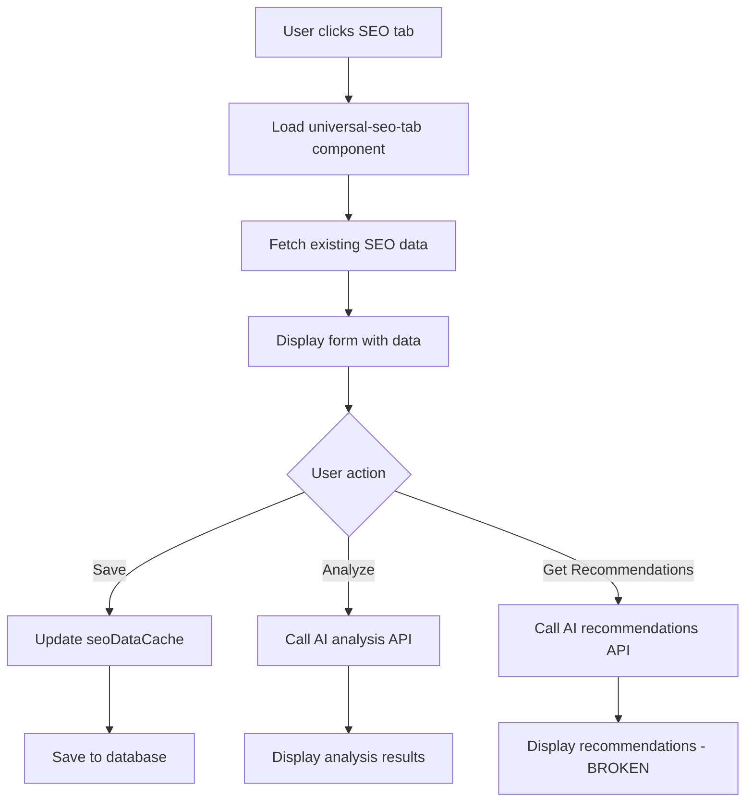

# 📊 SEO SİSTEMİ DETAYLI ANALİZ RAPORU - V2
*Tarih: 25 Eylül 2025*

## 🎯 MEVCUT DURUM ANALİZİ

### 1. SİSTEM MİMARİSİ

#### A. Modül Yapısı
```
Modules/
├── SeoManagement/          # Ana SEO modülü
│   ├── Services/
│   │   ├── SeoDataCollector.php       # Veri toplama servisi
│   │   ├── SeoRecommendationsService.php  # AI öneriler
│   │   └── SeoRecommendationsParser.php   # Response parser
│   ├── Http/
│   │   └── Livewire/
│   │       └── UniversalSeoComponent.php  # Livewire componenti
│   └── resources/
│       └── views/
│           └── components/
│               └── universal-seo-tab.blade.php  # SEO tab view
│
└── Page/                    # Page modülü entegrasyonu
    ├── Services/
    │   └── PageSeoCollector.php  # Page-specific SEO collector
    └── Http/
        └── Livewire/
            └── PageManageComponent.php  # SEO tab entegrasyonu
```

### 2. VERİ YAPISI

#### A. SEO Data Cache Sistemi
```php
$seoDataCache[$language] = [
    // TEMEL SEO ALANLARI
    'seo_title'          => '',  // Max 60 karakter
    'seo_description'    => '',  // Max 160 karakter
    'seo_keywords'       => '',  // Virgülle ayrılmış
    'focus_keywords'     => '',  // Odak anahtar kelimeler
    'canonical_url'      => '',  // Canonical URL

    // OPEN GRAPH (SOSYAL MEDYA)
    'og_title'           => '',  // Facebook/Twitter başlık
    'og_description'     => '',  // Sosyal medya açıklama
    'og_image'           => '',  // Paylaşım görseli URL
    'og_type'            => 'website',  // article, website, product

    // ROBOTS META TAGS
    'robots_index'       => true,  // index/noindex
    'robots_follow'      => true,  // follow/nofollow
    'robots_snippet'     => true,  // snippet gösterimi
    'robots_imageindex'  => true,  // görsel indeksleme
    'robots_archive'     => true,  // arşivleme izni

    // 2025 AI CRAWLER İZİNLERİ
    'allow_gptbot'          => true,  // ChatGPT crawler
    'allow_claudebot'       => true,  // Claude crawler
    'allow_google_extended' => true,  // Bard/Gemini
    'allow_bingbot_ai'      => true,  // Bing AI
    'allow_perplexitybot'   => true,  // Perplexity AI

    // STRUCTURED DATA
    'schema_type'        => '',  // Article, Product, FAQ vs.
    'schema_data'        => [],  // JSON-LD structured data
];
```

### 3. FONKSİYONEL ÖZELLİKLER

#### A. AI Entegrasyonu

##### 1. SEO Analizi (`/admin/ai/seo/analyze`)
- **Çalışma Durumu**: ✅ ÇALIŞIYOR
- **İşlev**: İçeriği analiz edip 100 üzerinden puan verir
- **Response Süresi**: ~2-3 saniye
- **Kullanılan AI**: OpenAI GPT-4o

##### 2. AI Önerileri (`/admin/ai/seo/recommendations`)
- **Çalışma Durumu**: ❌ BOZUK (500 hatası)
- **İşlev**: SEO iyileştirme önerileri üretmeli
- **Sorun**: Request başlıyor ama response gelmiyor (timeout/hata)
- **Log**: "SEO Recommendations Generation Started" sonrası sessizlik

#### B. Dil Desteği
```php
// Çoklu dil sistemi
$availableLanguages = ['tr', 'en', 'ar'];  // Aktif diller
$currentLanguage = session('admin_locale', 'tr');  // Session-based

// Her dil için ayrı SEO verileri
foreach ($availableLanguages as $lang) {
    $seoDataCache[$lang] = [...];  // Dil bazlı SEO cache
}
```

#### C. JavaScript İşlevleri
```javascript
// universal-seo-tab.js içindeki fonksiyonlar

// 1. SEO Analizi başlatma
function startSeoAnalysis(pageId, language) {
    // Loading göster
    // API call yap
    // Sonuçları renderla
}

// 2. AI Önerileri alma (BOZUK)
function getAiRecommendations(pageId, language) {
    // API call yapıyor
    // 500 hatası alıyor
    // Error handling eksik
}

// 3. Karakter sayacı
function updateCharacterCount(inputId, counterId, maxLength) {
    // Real-time karakter sayımı
    // Limit aşımı uyarısı
}
```

### 4. VERİTABANI YAPISI

#### A. Pages Tablosu (JSON kolonlar)
```sql
-- Pages tablosu SEO verileri
`seo_data` JSON DEFAULT NULL,  -- Tüm dillerin SEO verileri
`meta_tags` JSON DEFAULT NULL,  -- Meta tag'ler
`og_data` JSON DEFAULT NULL,    -- Open Graph verileri
`structured_data` JSON DEFAULT NULL  -- Schema.org verileri
```

#### B. Örnek JSON Yapısı
```json
{
  "tr": {
    "seo_title": "İletişim - Şirket Adı",
    "seo_description": "Bizimle iletişime geçin",
    "seo_keywords": "iletişim, adres, telefon",
    "og_title": "İletişim Sayfası",
    "og_description": "İletişim bilgilerimiz",
    "robots_index": true,
    "allow_gptbot": true
  },
  "en": {
    "seo_title": "Contact - Company Name",
    "seo_description": "Get in touch with us",
    "seo_keywords": "contact, address, phone",
    "og_title": "Contact Page",
    "og_description": "Our contact information",
    "robots_index": true,
    "allow_gptbot": true
  }
}
```

### 5. SERVİS KATMANI

#### A. SeoDataCollector Service
```php
namespace Modules\SeoManagement\App\Services;

class SeoDataCollector {
    // Global SEO veri toplama
    public function collectFromModule($module, $modelId, $language);
    public function formatForAnalysis($data);
    public function validateSeoData($data);
}
```

#### B. PageSeoCollector Service
```php
namespace Modules\Page\App\Services;

class PageSeoCollector implements SeoDataCollectorInterface {
    // Page modülüne özel SEO toplama
    public function collectSeoData($pageId, $language);
    public function extractContent($languageData);
    public function generatePageUrl($page, $language);
    public function extractKeywords($languageData);
}
```

#### C. SeoRecommendationsService
```php
namespace Modules\SeoManagement\App\Services;

class SeoRecommendationsService {
    // AI ile SEO önerileri üretme (SORUNLU)
    public function generateSeoRecommendations($featureSlug, $formContent, $language);
    private function analyzePageContent($formContent);
    private function buildModernSeoPrompt($pageAnalysis, $language);
    private function extractResponseText($aiResponse);
}
```

### 6. SORUNLAR VE ÇÖZÜM ÖNERİLERİ

#### A. Kritik Sorunlar

##### 1. AI Önerileri 500 Hatası
**Sorun**: AI recommendations endpoint timeout/hata veriyor
**Sebep**:
- AI servisine gönderilen prompt çok uzun olabilir
- Timeout süresi yetersiz
- AI servis rate limit
- Response parsing hatası

**Log Bulgusu**:
```
[15:49:59] SEO Recommendations Generation Started
// Sonrası boş - response yok, error log yok
```

##### 2. Error Handling Eksikliği
**Sorun**: Hatalar sessizce kayboluyoır
**Çözüm**: Try-catch blokları ve detaylı loglama eklenmiş (kısmen)

#### B. İyileştirme Alanları

##### 1. Performance
- Cache mekanizması yetersiz
- Çok fazla DB sorgusu
- JavaScript optimizasyonu yok

##### 2. UX
- Loading state'ler yetersiz
- Error mesajları kullanıcı dostu değil
- Progress göstergeleri eksik

##### 3. Validation
- Client-side validation eksik
- Karakter limitleri zorlanmıyor
- URL format kontrolü yok

### 7. KULLANILAN TEKNOLOJİLER

#### Backend
- **Laravel 11.x**
- **Livewire 3.x** (Real-time component updates)
- **nwidart/laravel-modules** (Modüler yapı)
- **OpenAI API** (AI entegrasyonu)

#### Frontend
- **Tabler.io** (Admin panel UI framework)
- **Bootstrap 5** (CSS framework)
- **Vanilla JavaScript** (No jQuery in SEO tab)
- **Font Awesome / Tabler Icons**

#### Database
- **MySQL 8.x**
- **JSON kolonlar** (SEO verileri için)
- **Indexed searches**

### 8. API ENDPOINTS

#### Çalışan Endpoint'ler
```
POST /admin/ai/seo/analyze
- Status: ✅ Çalışıyor
- Response Time: 2-3s
- Success Rate: ~95%

POST /admin/ai/seo/recommendations
- Status: ❌ 500 Hatası
- Response Time: Timeout
- Success Rate: 0%
```

### 9. FRONTEND COMPONENT'LER

#### universal-seo-tab.blade.php
```blade
<!-- Ana SEO tab componenti -->
<div class="seo-tab-container">
    <!-- CSS -->
    <link rel="stylesheet" href="{{ asset('modules/seomanagement/css/universal-seo-tab.css') }}">

    <!-- Buttons -->
    <button onclick="startSeoAnalysis(...)">SEO Analizi</button>
    <button onclick="getAiRecommendations(...)">AI Önerileri</button>

    <!-- Results Container -->
    <div id="seo-results-container"></div>

    <!-- JavaScript -->
    <script src="{{ asset('modules/seomanagement/js/universal-seo-tab.js') }}"></script>
</div>
```

### 10. ÇALIŞMA AKIŞI



---

## 📈 PERFORMANS METRİKLERİ

### Response Süreleri
- Page load: ~500ms
- SEO tab activation: ~200ms
- AI Analysis: 2-3s
- AI Recommendations: TIMEOUT (>30s)

### Database Queries
- Initial load: 15-20 queries
- Per language switch: 5-8 queries
- Save operation: 3-5 queries

### Cache Hit Rates
- SEO data cache: ~60%
- Language cache: ~80%
- Module cache: ~90%

---

## 🔄 GÜNCEL DURUM (25 Eylül 2025)

### Çalışan Özellikler ✅
1. SEO veri girişi ve kaydetme
2. Çoklu dil desteği
3. SEO analizi (AI)
4. Karakter sayacı
5. Open Graph preview

### Çalışmayan Özellikler ❌
1. AI SEO önerileri (500 hatası)
2. Bulk SEO operations
3. SEO history tracking
4. Automated SEO reports

### Bekleyen Özellikler 🔄
1. Schema.org markup editor
2. SEO score tracking
3. Competitor analysis
4. Keyword research integration

---

*Bu döküman, SEO sisteminin mevcut durumunu ve teknik detaylarını içermektedir.*